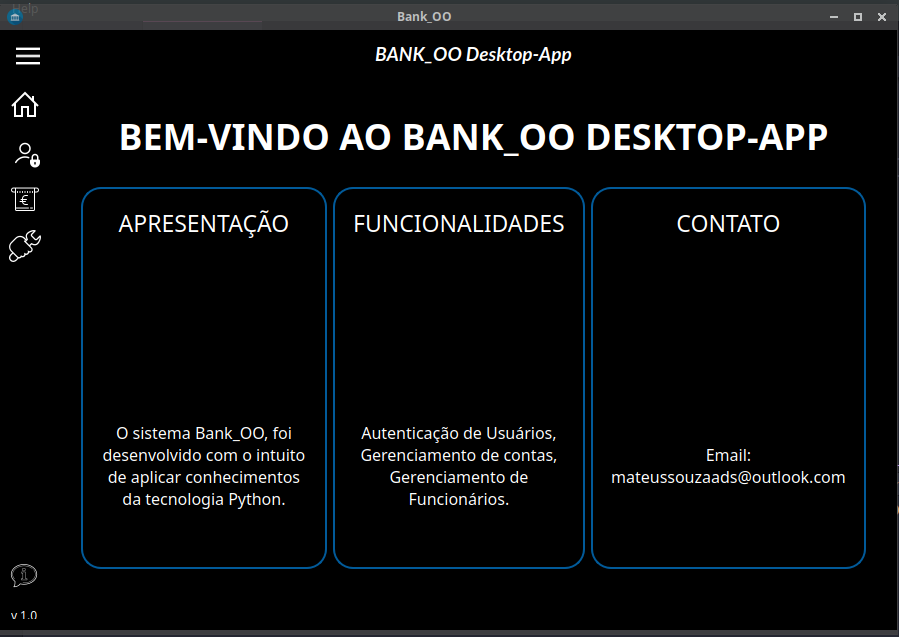
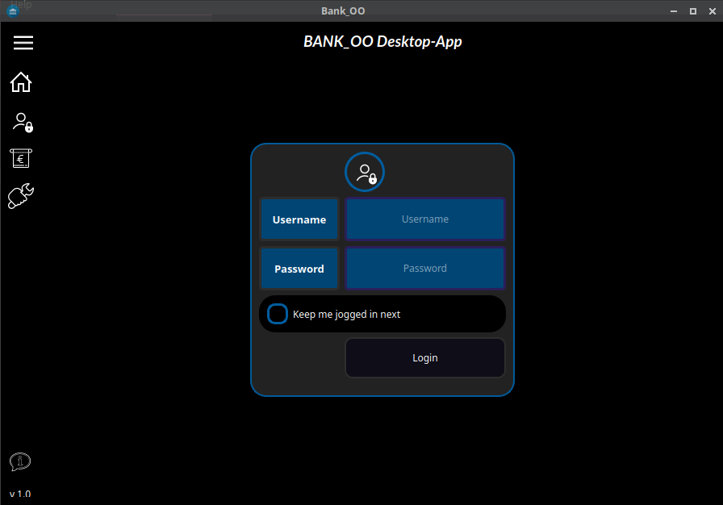
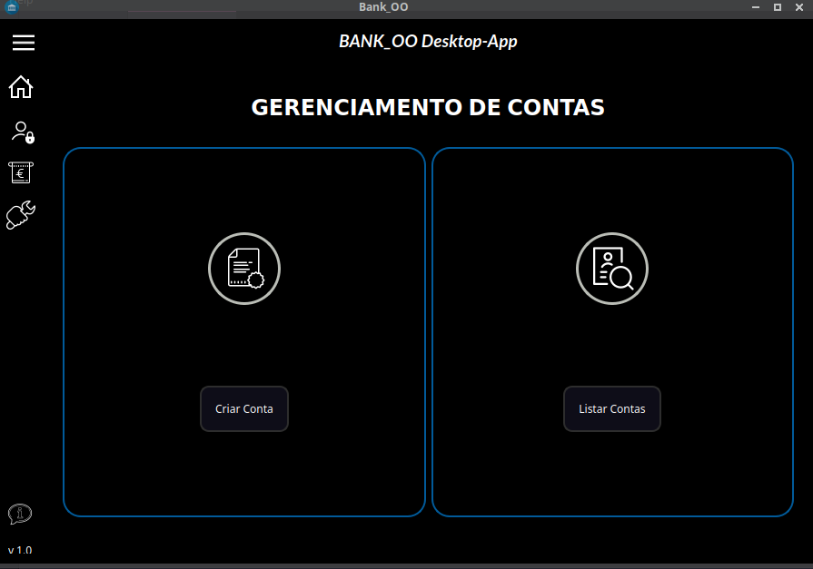
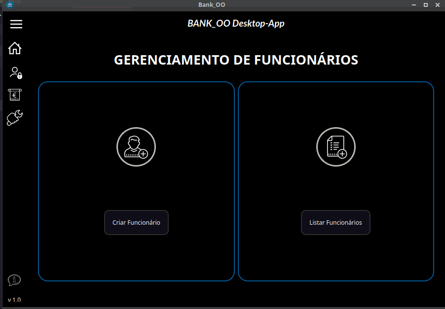

# SISTEMA BANK_OO

Projeto desenvolvido para a uso pessoal e tambem uma forma de aplicar os conhecimentos já aprendidos. 

## Objetivo

O principal objetivo do System Bank_OO é simular um pequeno software de uma agência bancária, onde aplico os conhecimentos em programação funcional, banco de dados, modularização e etc... 
O System Bank_OO é um sistema desktop responsivo, utilizando os recursos da tecnologia PyQt5, visando uma boa experiência do usuário. Contém área de login, inclusão, edição, listagem e deleção de novas contas ou de novos funcionários

## Funcionalidades

- Toggle Menu
- Janela Responsiva
- Autenticação
- Gerenciamento de Contas
- Gerenciamento de Funcionários

## Tecnologias

`Obs: É necessário ter um ambiente de desenvolvimento Python instalado em sua máquina.`

- [Python 3.8](https://www.python.org/downloads/)

- [VsCode](https://code.visualstudio.com/download)

- [Biblioteca PyQt5](https://pypi.org/project/PyQt5/)

## Video

`Obs: Video completo de aprensentação das funcionalidades do sistema.`

## Screenshots

## Licença

Este projeto está sob a licença MIT.

## Autor

Mateus Souza de Jesus, formado em Analise e Desenvolvimento de Sistemas, pelo Centro Universitário Leonardo da Vinci. Estudo a linguagem Python, e também ciência de dados.
